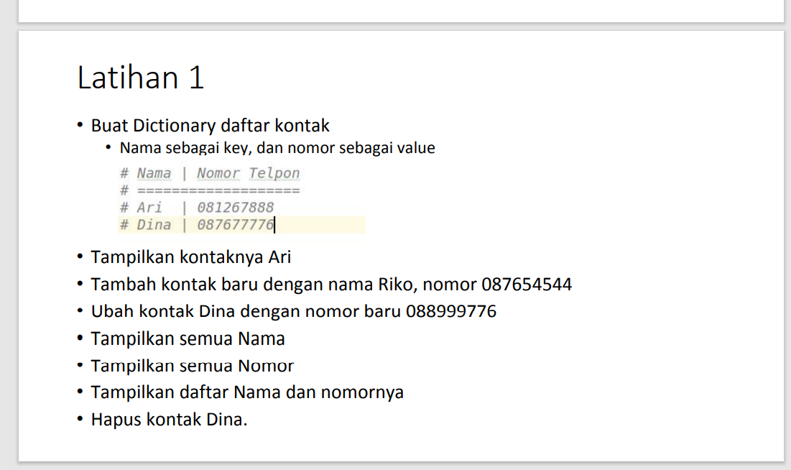
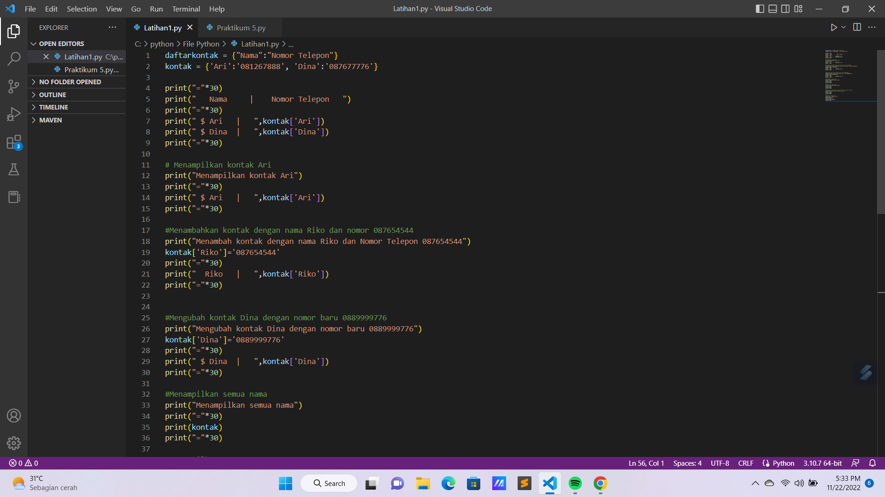
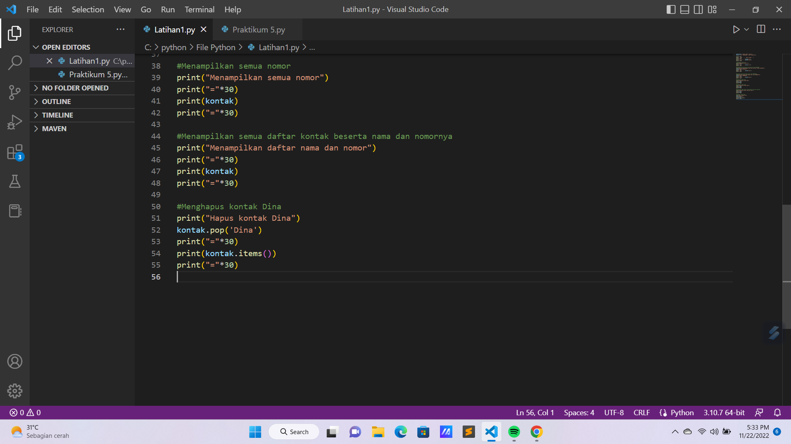
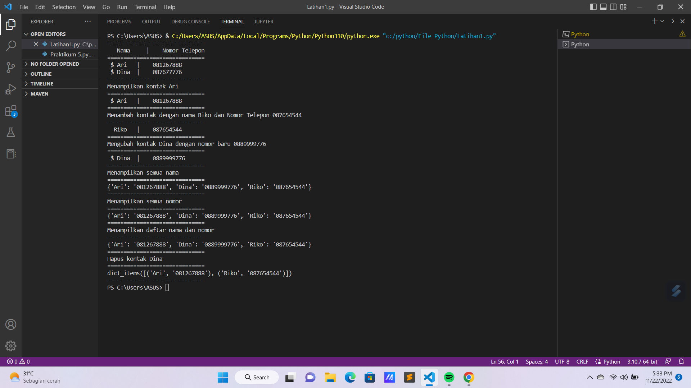

# Praktikum 5 Pertemuan ke 10

|Nama|NIM|Kelas|Matkul|
|----|---|-----|------|
|Muhammad Ikhsan Fakhrudin|312210019|TI.22.A2|Pemrograman|

# Latihan 1

Tulis Kode Program Seperti Berikut Ini :

# Output

Maka Hasil Kode Program Di Atas Akan Seperti Ini :

# Tugas Praktikum 5

