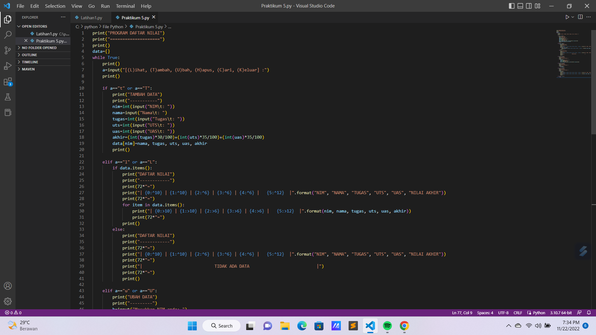
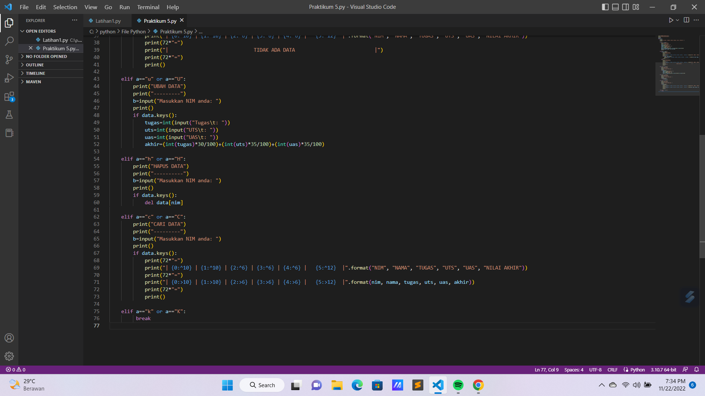
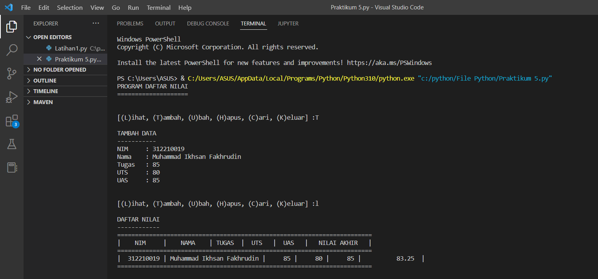
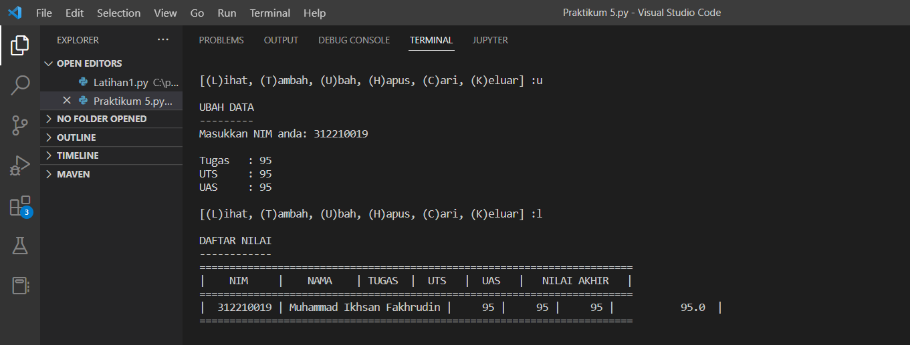
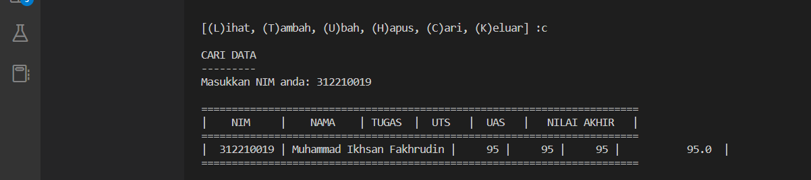
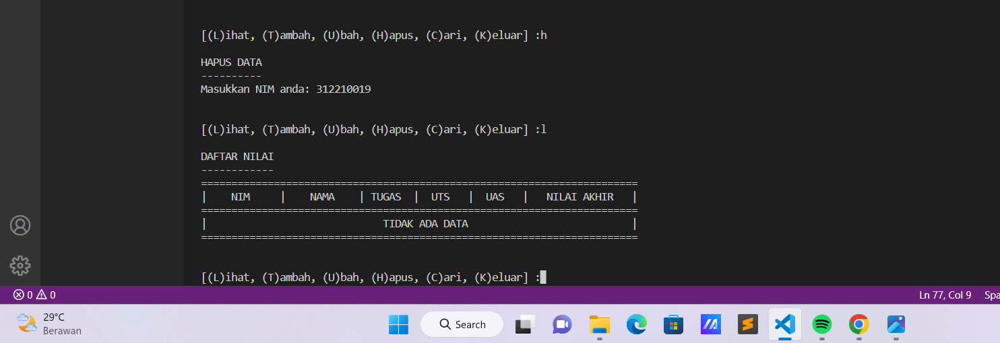

# Praktikum 5 Pertemuan ke 10

|Nama|NIM|Kelas|Matkul|
|----|---|-----|------|
|Muhammad Ikhsan Fakhrudin|312210019|TI.22.A2|Pemrograman|

# Latihan 1


Tulis Kode Program Seperti Berikut Ini :


# Output

Maka Hasil Kode Program Di Atas Akan Seperti Ini :


# Tugas Praktikum 5


# Kode Program

tulis kode program seperti berikut ini :





# Penjelasan

1. Membuat Dictonary Kosong yang akan Di Input Dengan Data.

```apa
data={}
```

2. Membuat Perulangan dengan While yang terdapat pada Menu untuk Menjalankan Program.

```
while True:
    print()
    a=input("[(L)ihat, (T)ambah, (U)bah, (H)apus, (C)ari, (K)eluar] :")
    print()
```

3. Menambahkan Data Yang Dibutuhkan Seperti Data Nim, Nama, Nilai Tugas, Uts, dan Uas. Data yang Di Input akan Masuk ke Dalam Dictonary Data dengan Nim sebagai keys sedangkan nama, tugas, uts dan uas sebagai Values.

```
if a=="t" or a=="T":
        print("TAMBAH DATA")
        print("-----------")
        nim=int(input("NIM\t: "))
        nama=input("Nama\t: ")
        tugas=int(input("Tugas\t: ")) 
        uts=int(input("UTS\t: "))
        uas=int(input("UAS\t: "))
        akhir=(int(tugas)*30/100)+(int(uts)*35/100)+(int(uas)*35/100)
        data[nim]=nama, tugas, uts, uas, akhir
        print()
```

4. Menampilkan atau Melihat Data. Jika Sebelumnya belum Menginputnya Maka Tampilan "Tidak Ada". Apabila sudah Menginput Data. Maka Data Akan Ditampilkan.

```
elif a=="l" or a=="L":
        if data.items():
            print("DAFTAR NILAI")
            print("------------")
            print(72*"=")
            print("| {0:^10} | {1:^10} | {2:^6} | {3:^6} | {4:^6} |   {5:^12}  |".format("NIM", "NAMA", "TUGAS", "UTS", "UAS", "NILAI AKHIR"))
            print(72*"=")
            for item in data.items(): 
                print("| {0:>10} | {1:>10} | {2:>6} | {3:>6} | {4:>6} |   {5:>12}  |".format(nim, nama, tugas, uts, uas, akhir))
                print(72*"=")
            print()
        else:
            print("DAFTAR NILAI")
            print("------------")
            print(72*"=")
            print("| {0:^10} | {1:^10} | {2:^6} | {3:^6} | {4:^6} |   {5:^12}  |".format("NIM", "NAMA", "TUGAS", "UTS", "UAS", "NILAI AKHIR"))
            print(72*"=")
            print("|                             TIDAK ADA DATA                           |")
            print(72*"=")
            print()
```

5. Apabila Ingin Mengubah Data, maka Anda akan diminta untuk menginputkan kembali Nim yang Telah Di Input. Setelah Itu Data apat Diubah.

```
elif a=="u" or a=="U":
        print("UBAH DATA")
        print("---------")
        b=input("Masukkan NIM anda: ")
        print()
        if data.keys():
            tugas=int(input("Tugas\t: ")) 
            uts=int(input("UTS\t: "))
            uas=int(input("UAS\t: "))
            akhir=(int(tugas)*30/100)+(int(uts)*35/100)+(int(uas)*35/100)
```

6. Jika Ingin Menghapus Data, anda akan Diminta Menginputkan Nim Nya kemabli. Lalu Data yang telah Di Input sejak Awal akan terhapus beserta Valuesnya (Nama, Nilai Tugas, Nilai Uts, dan NIlai Uas).

```
elif a=="h" or a=="H":
        print("HAPUS DATA")
        print("----------")
        b=input("Masukkan NIM anda: ")
        print()
        if data.keys():
            del data[nim]
```

7. Jika Ingin Mencari Data. Anda Akan Diminta Unutk Menginputkan Nim Kemudian Data yang Anda cari akan muncul.

```
elif a=="c" or a=="C":
        print("CARI DATA")
        print("---------")
        b=input("Masukkan NIM anda: ")
        print()
        if data.keys():
            print(72*"=")
            print("| {0:^10} | {1:^10} | {2:^6} | {3:^6} | {4:^6} |   {5:^12}  |".format("NIM", "NAMA", "TUGAS", "UTS", "UAS", "NILAI AKHIR"))
            print(72*"=")
            print("| {0:>10} | {1:>10} | {2:>6} | {3:>6} | {4:>6} |   {5:>12}  |".format(nim, nama, tugas, uts, uas, akhir))
            print(72*"=")
            print()
```

8. Setelah Sudah Selesai Meginputkan Data, Pilih ('k'/K') maka Program akan Terhenti.

```
elif a=="k" or a=="K":
         break
```

# Output

maka hasil dari kode program di atas akan seperti ini :









**Sekian Tugas Pada Kali Ini.**

**Kurang Lebihnya Saya Mohon Maaf...**

**Wassalamualaikum wr.wb**
